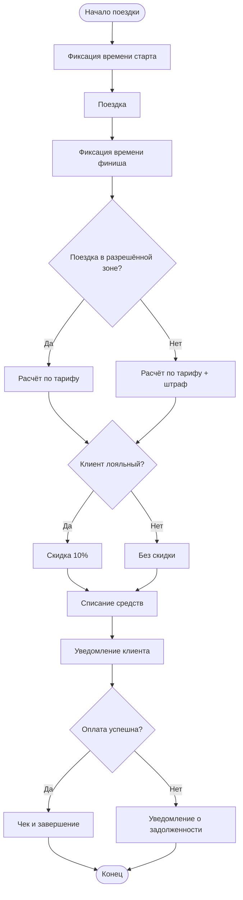

# Flowchart: Расчёт стоимости аренды

```mermaid
flowchart TD
    A([Начало поездки]) --> B[Фиксация времени старта]
    B --> C[Поездка]
    C --> D[Фиксация времени финиша]
    D --> E{Поездка в разрешённой зоне?}
    E -->|Да| F[Расчёт по тарифу]
    E -->|Нет| G[Расчёт по тарифу + штраф]
    F --> H{Клиент лояльный?}
    G --> H
    H -->|Да| I[Скидка 10%]
    H -->|Нет| J[Без скидки]
    I --> K[Списание средств]
    J --> K
    K --> K2[Уведомление клиента]
    K2 --> L{Оплата успешна?}
    L -->|Да| M[Чек и завершение]
    L -->|Нет| N[Уведомление о задолженности]
    M --> O([Конец])
    N --> O
```
