Отчёт по лабораторной работе №1

Тема процесса: аренда автомобиля (каршеринг)

Краткое описание процесса

В работе смоделирован процесс аренды автомобиля через приложение каршеринга, начиная от авторизации клиента и выбора машины на карте до завершения поездки и списания средств. Процесс включает несколько участников, три точки ветвления и параллельную работу телеметрии и приложения во время поездки.

Диаграмма BPMN

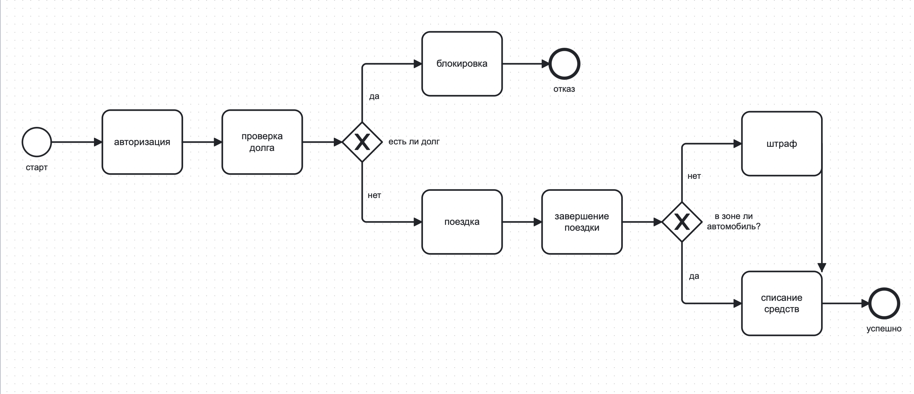

Диаграмма UML Activity

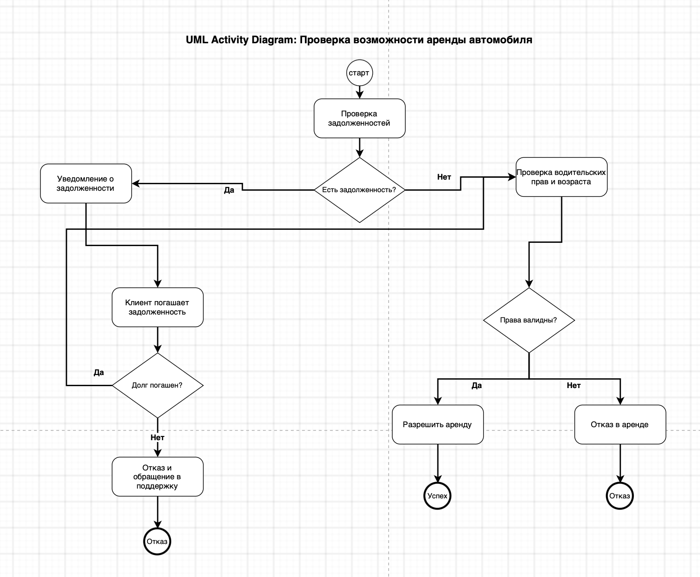

Диаграмма Sequence

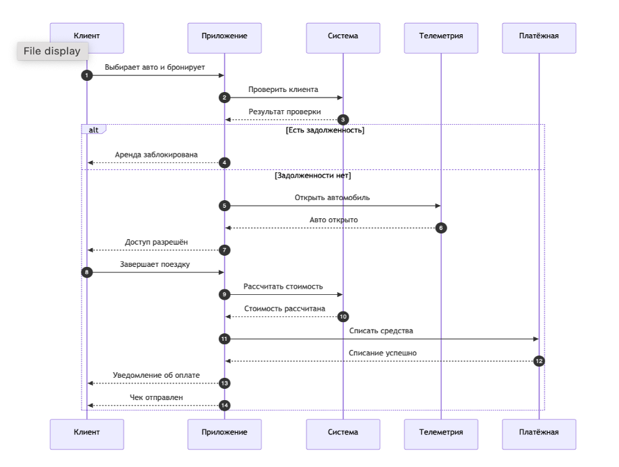

Диаграмма Flowchart

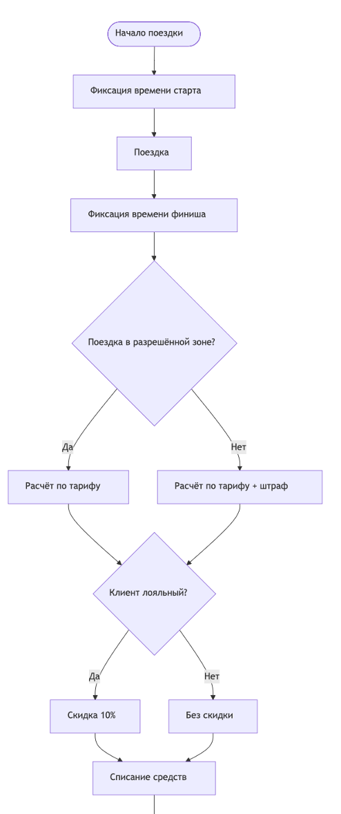

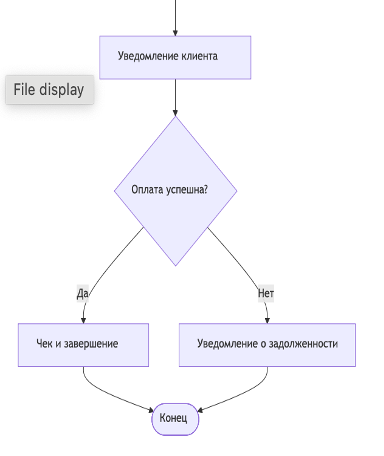

Различия между диаграммами (diff)

BPMN

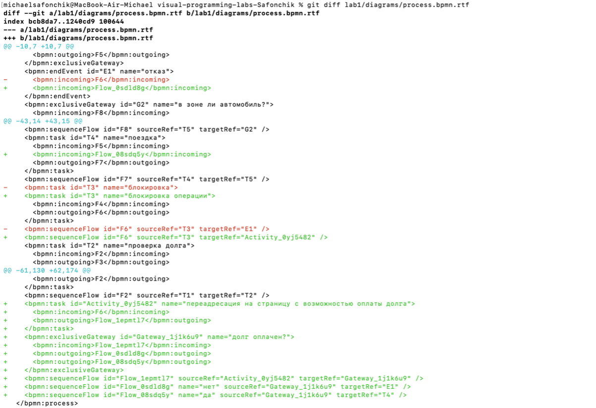

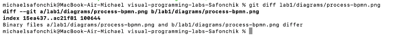

UML

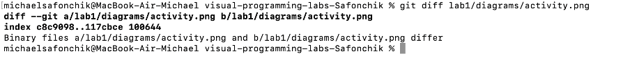

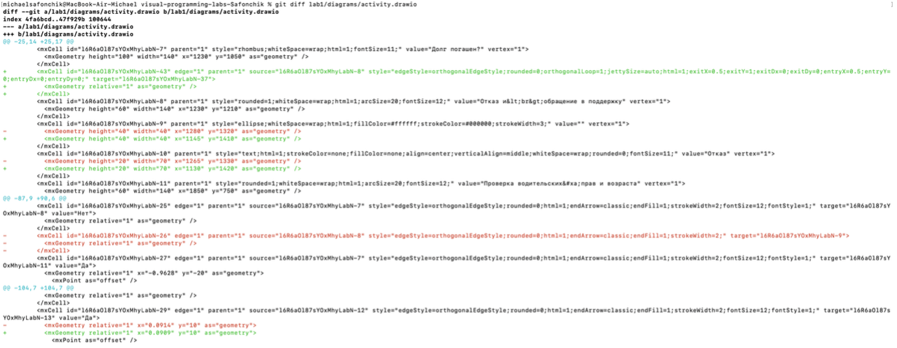

Sequence

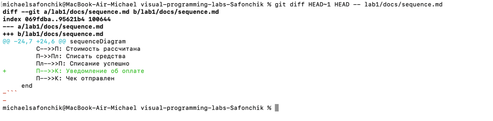

Flowchart

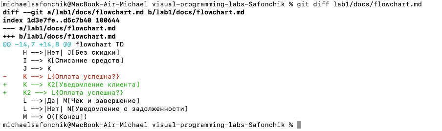

Выводы

В ходе работы я освоил базовые команды Git. Настроил SSH-ключ для безопасной работы с GitHub и создал токен. Создал репозиторий и оформил структуру проекта. Постарался разобраться с созданием диаграмм в трёх редакторах. Вроде как понял отличие текстовых форматов от бинарных — текстовые файлы позволяют отслеживать изменения построчно, а бинарные нет. Это стало понятно на примере diff для .bpmn и .png.
