# Отчёт по лабораторной работе №2 (Node-RED)

## Основное

Собрал 12 потоков в Node-RED, каждый на отдельной вкладке. Все экспортировал в JSON и сделал скриншоты.

## AI-промпты:

Function node:
Напиши JavaScript-код для ноды Function в Node-RED:
использовать let/const, if/else, for, массив, объект.
На вход — msg.payload (число 1-10). Вернуть объект со статусом и суммой.

Template node:
Напиши Mustache-шаблон для ноды Template в Node-RED.
На вход — объект с полями name, group, timestamp. Формирует JSON.

## Освоенные ноды

inject, debug, function, switch, change, template, http in, http response, http request, mqtt in, mqtt out, file in, file out, telegram receiver, telegram sender, ui_gauge, ui_chart, flow context.

## Установка и версии

- Способ: Docker
- Образ: nodered/node-red:latest
- Node-RED: v5.0.8
- Node.js: v24.21.0
- Порт: 1880
- Volume: ~/Documents/GitHub/visual-programming-labs-Safonchik/lab2/data:/data

## Скриншоты

### Версии
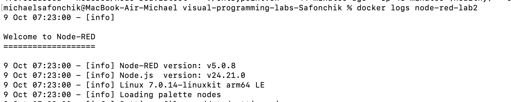

### 01-inject-debug
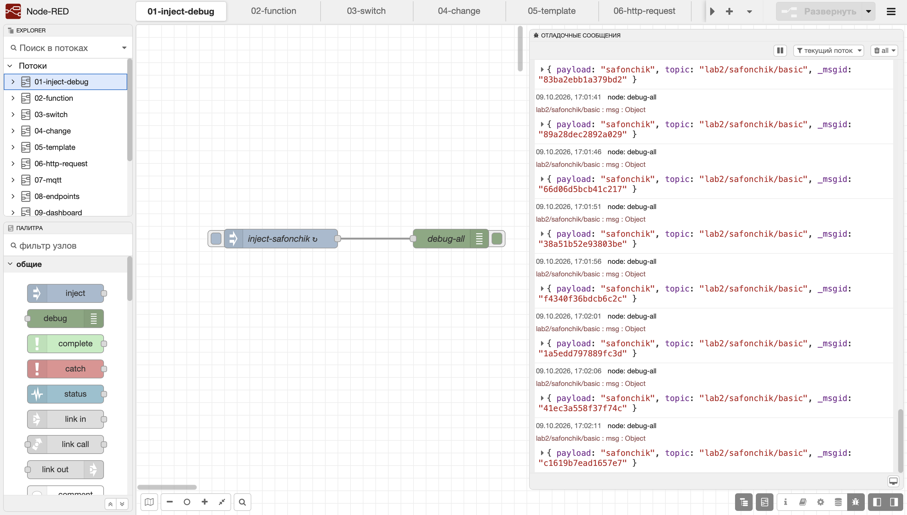

### 02-function
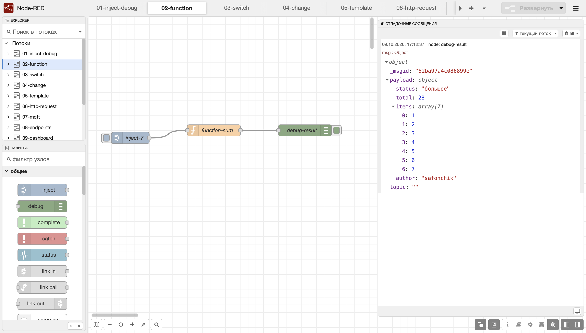

### 03-switch
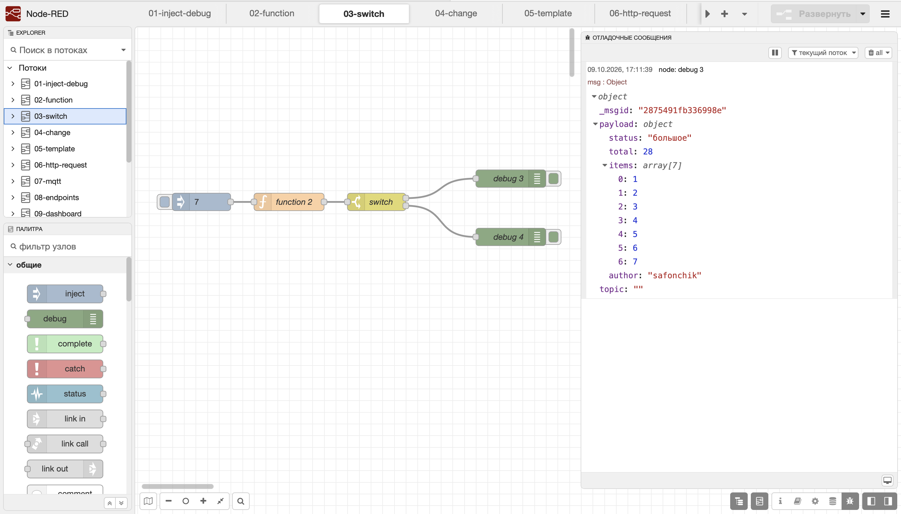

### 04-change
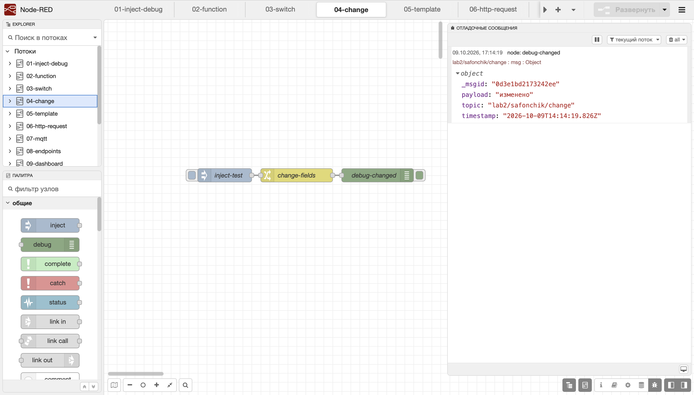

### 05-template
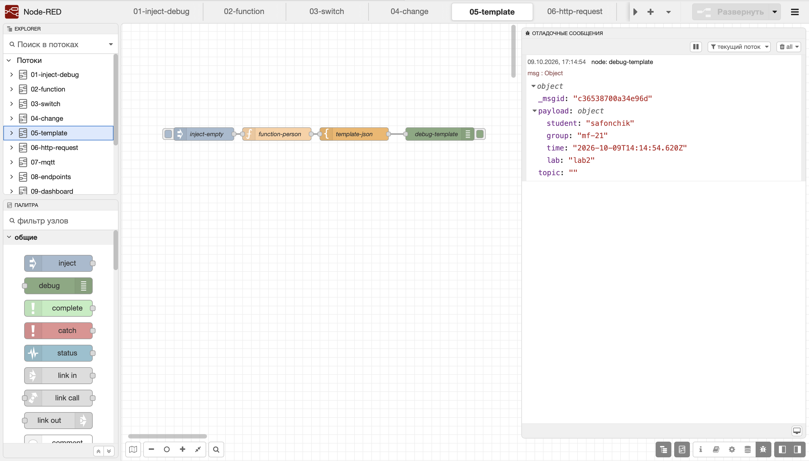

### 06-http-request
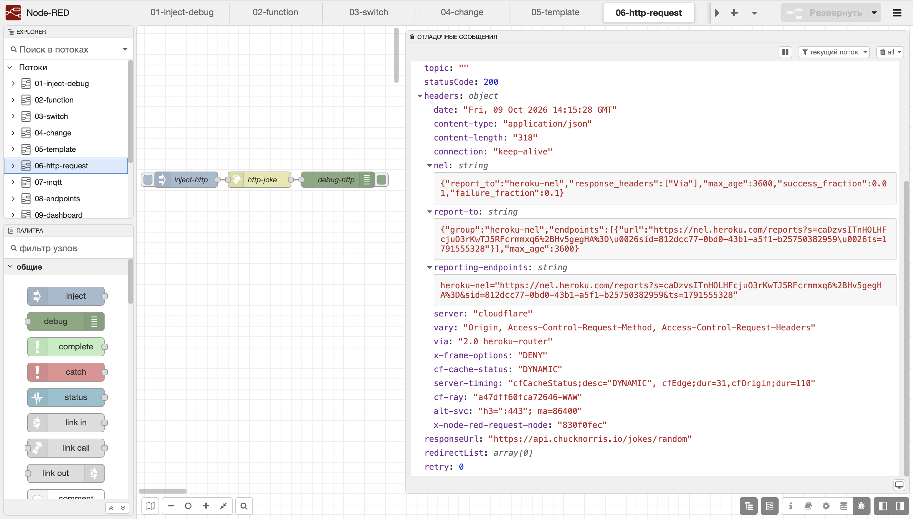

### 07-mqtt
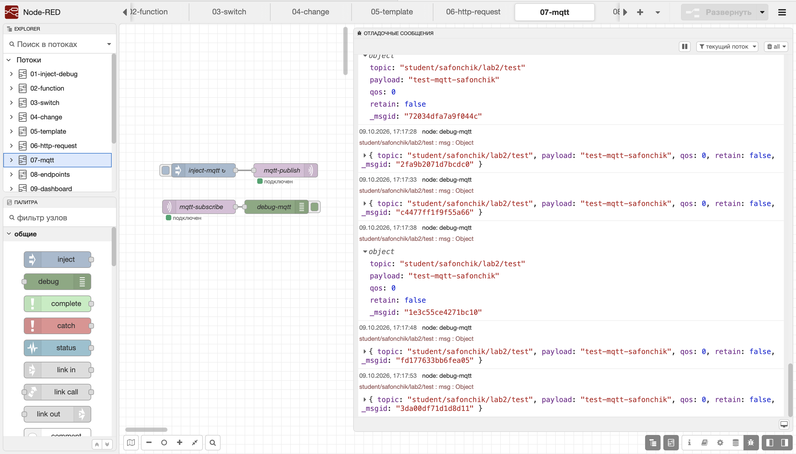

### 08a-endpoints-text
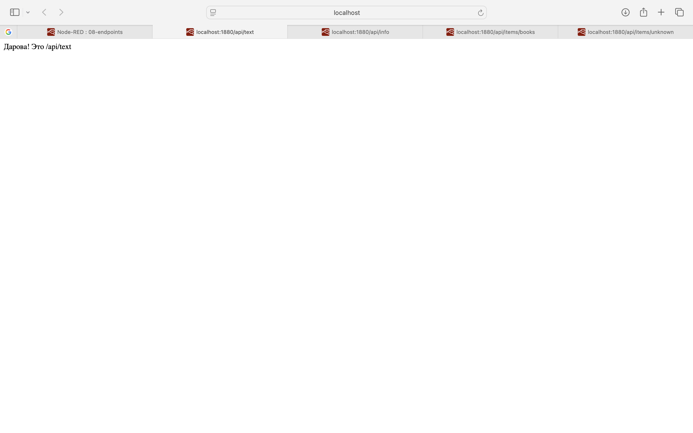

### 08b-endpoints-info
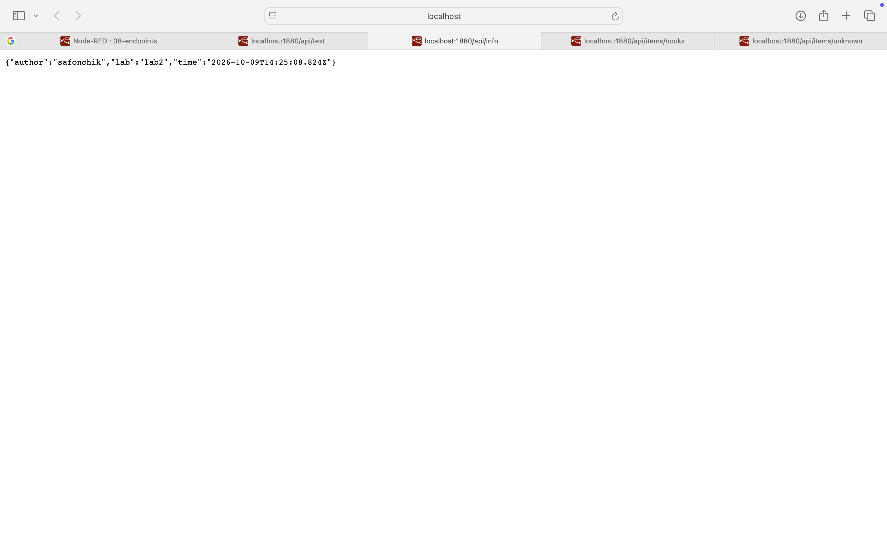

### 08c-endpoints-items-success
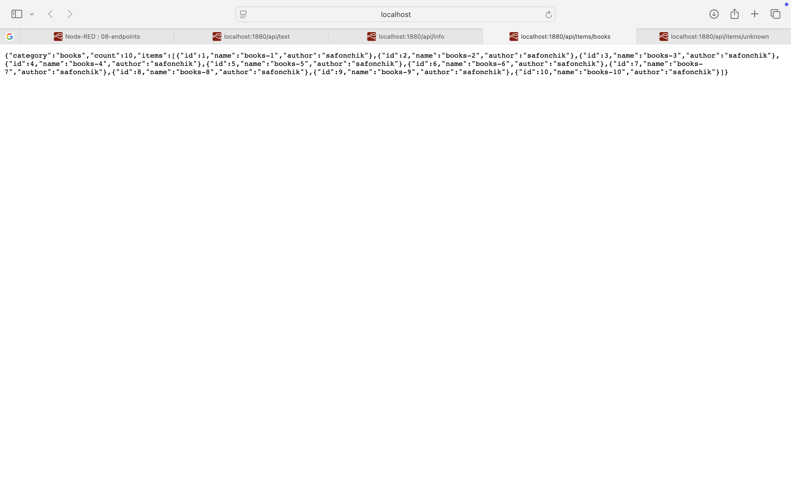

### 08d-endpoints-items-error
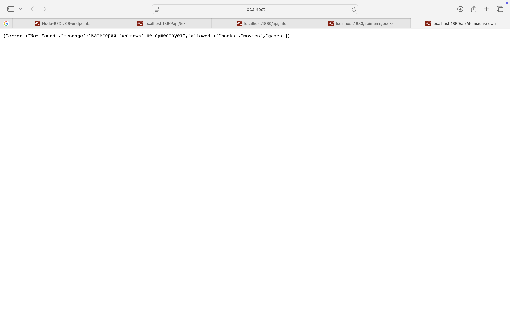

### 08e-endpoints-items-404
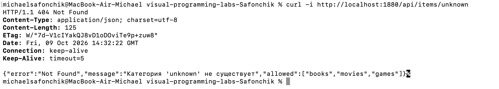

### 09-dashboard
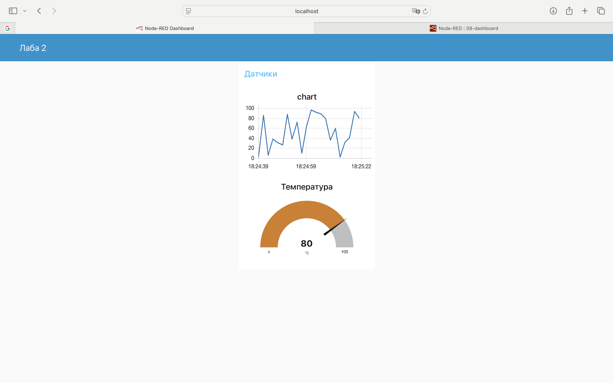

### 10-telegram
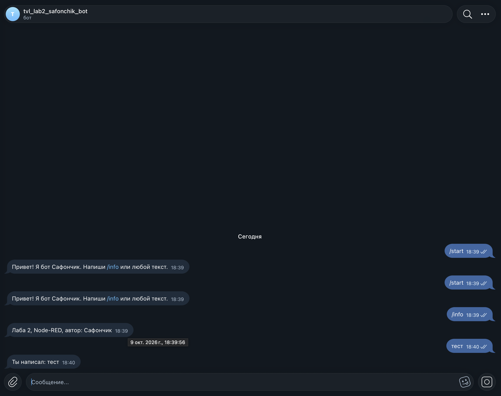

### 11-files
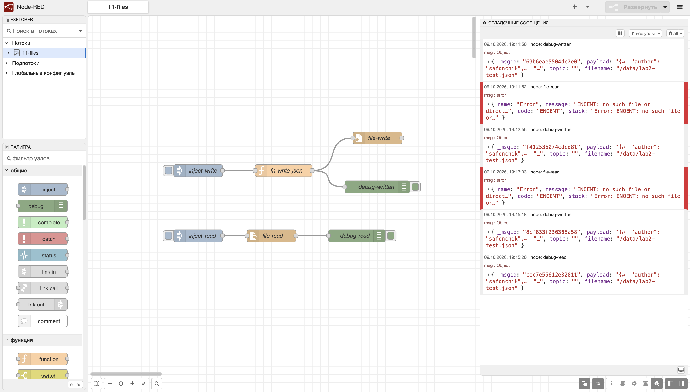

### 12-context
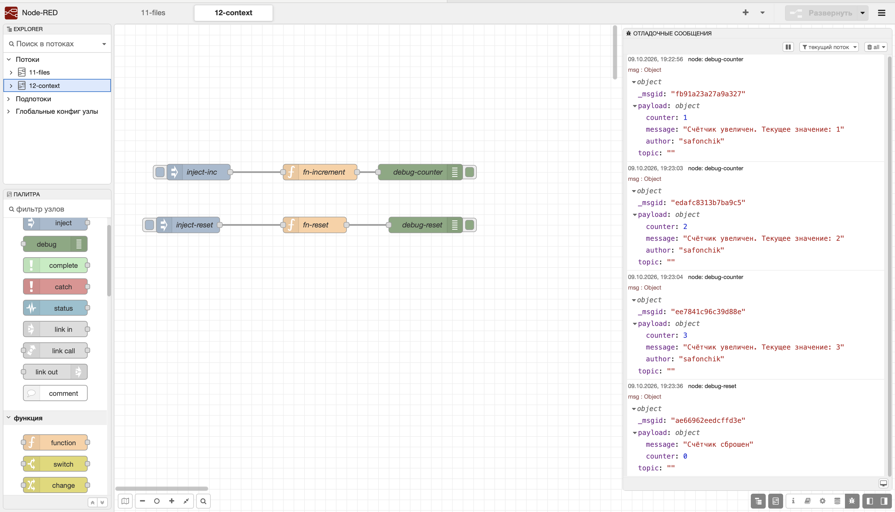

## Выводы

Разобрался с Node-RED. Понял, что потоки - это ноды, соединённые стрелками, данные передаются в msg. Node-RED - хороший инструмент для быстрого прототипирования короче
